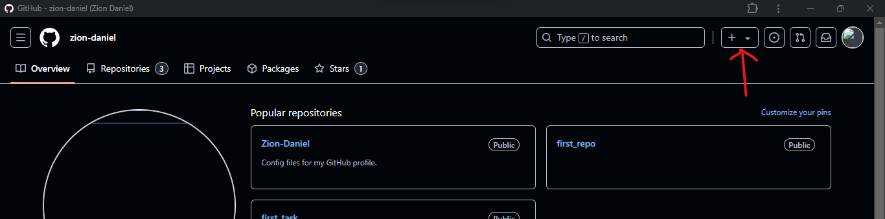
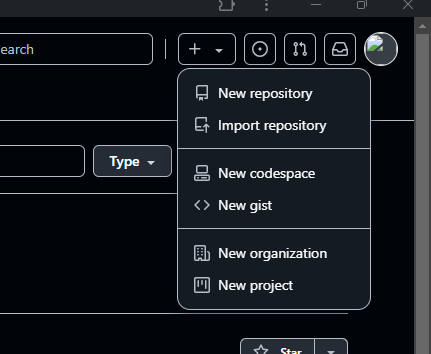
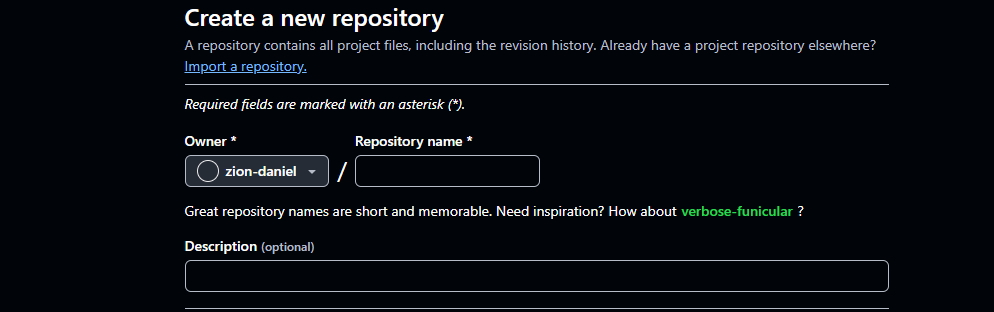
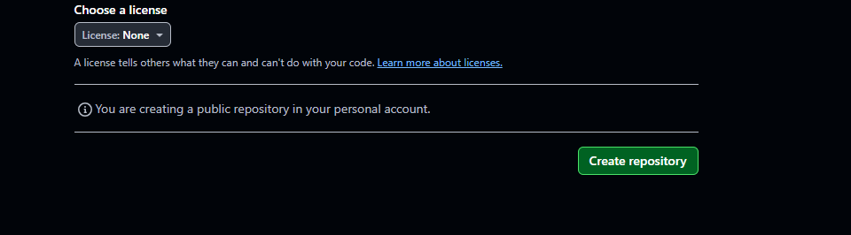
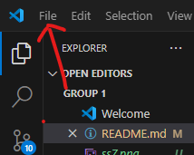
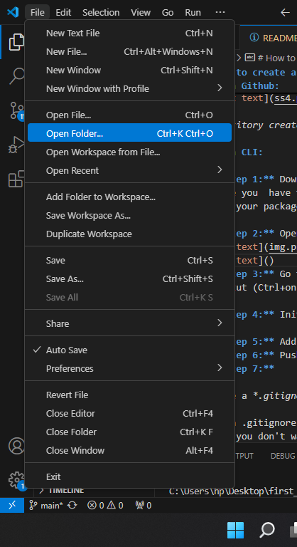
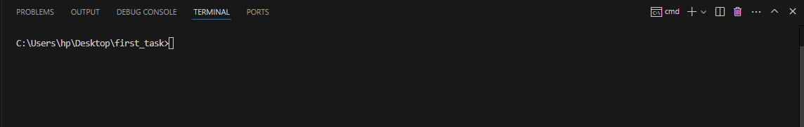
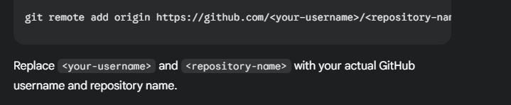
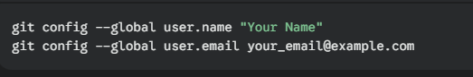

# How to create a git repository via github and via cmd

## Via Github: 
- **Step 1:** Sign into your github account/create a github account and click on the add(+) at the top right-hand side of the screen.

- **Step 2:** Click on "new repository" from the drop down menu.

- **Step 3:** Create/write down the new repo name.

- **Step 4:** Click on "create Repository".
 

*Repository created successfully...*

## Via CLI:

- **Step 1:** Download and install git.
Ensure you  have the github CLI installed, you can install using your package manager.

- **Step 2:** Open your project folder in VS Code.

- **Step 3:** Go to "Terminal" > "New Terminal" or use the shortcut (Ctrl+on Windows/Linux, Cmd+ on macOS).

- **Step 4:** Initialize a Local Repository

- **Step 5:** Add Remote Repository

- **Step 6:** Push Your Code:

- **Step 7:** 
\
Create a *.gitignore* File:
\
 Use a .gitignore file to specify files and directories that you don't want to track in Git.
\
*Commit Your Changes*: 
\
Use git add to stage changes and git commit -m "Commit message" to commit them.
\
*Configure Git*: 
\
Set your user name and email address:

*Repository created successfully...*